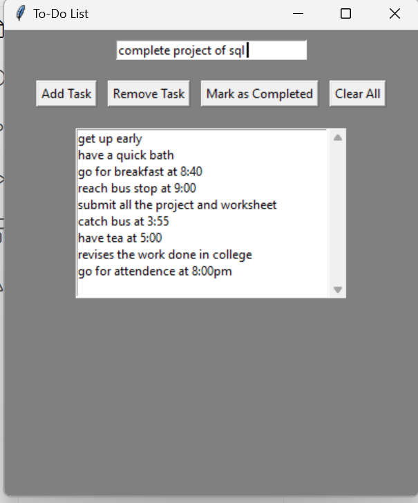

INTRODUCTION:

In our fast-paced world, effective task management is essential for productivity and organization. A to-do list is a fundamental tool that helps individuals prioritize and track their tasks. By integrating the principles of 
a queue data structure into a to-do list application, we can enhance task management in a systematic and efficient manner. A queue operates on a First-In, First-Out (FIFO) principle, where the first 
task added to the list is the first one to be completed. This approach mirrors natural workflows, allowing users to focus on tasks in the order they were received. With a queue-based to-do list, users can easily 
enqueue new tasks, ensuring that no important items are overlooked, while also dequeuing completed tasks to maintain an up-to-date view of their responsibilities. 
The benefits of a queue-based to-do list include improved organization, reduced cognitive load, and better prioritization of tasks. Users can seamlessly add, remove, and manage tasks while maintaining clarity 
about what needs to be accomplished next. This application is particularly useful for teams and individuals who juggle multiple responsibilities and need a structured way to stay on top of their commitments. 
By leveraging the efficiency of queues, this to-do list application provides a robust framework for managing tasks, enabling users to enhance their productivity and streamline their daily routines.

Block Diagram /  Flow Chart: 

1. Start: The application begins execution. 
 
2. Initialize Queue: Create an empty queue to store tasks. 
 
3. Display Main Menu: Present the user with options to add tasks, view the next task, complete a task, or exit. 
 
4. User Input Task: Wait for the user's input to select an option. 
 If the user selects "Add Task": 
 Prompt for a task description, validate the input (ensure it's not empty), enqueue the task, and display a confirmation message. 
 If the user selects "Display Tasks": 
 Show the current tasks in the queue. 
 
5. User Selects Action: The user decides on further actions. 
 If the user selects "View Next Task": 
 Display the front task of the queue or indicate if no tasks are available. 
 If the user selects "Complete Task": 
 Dequeue the front task and display a completion message. 
 
6. Exit: If the user chooses to exit, save tasks to the database (if applicable) and terminate the application. 
 
7. End: The application concludes its execution.
   
   
   
   
   
